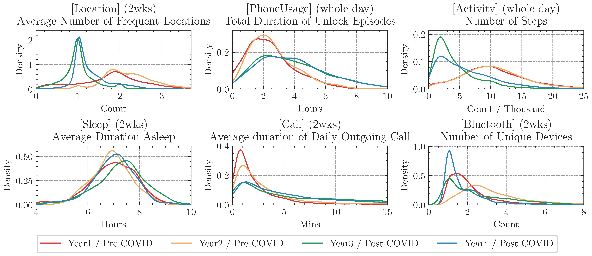
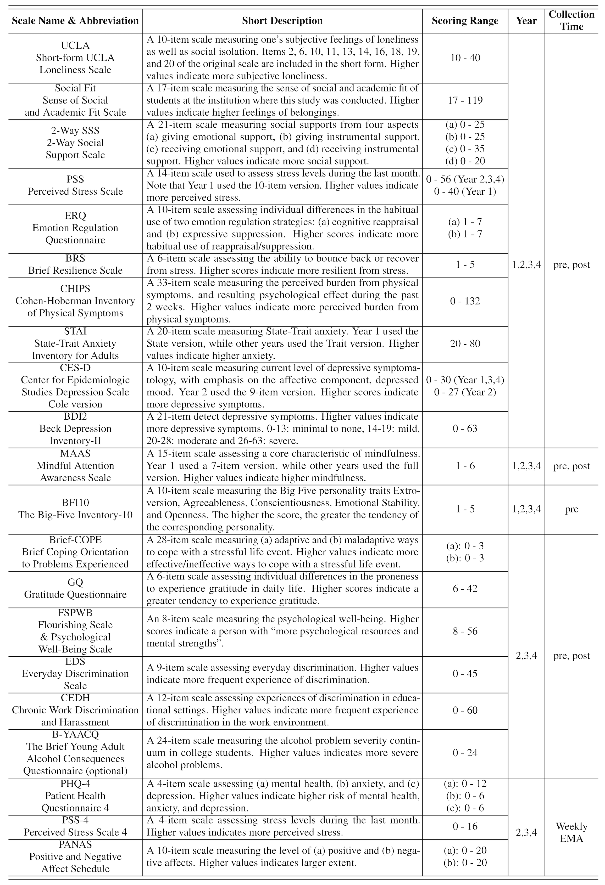

# Introduction

We present the basic description of the first released multi-year mobile and wearable sensing datasets that contain four data collection studies from 2018 to 2021, conducted at a Carnegie-classified R-1 university on the west coast. We name them `INS-W_1`, `INS-W_2`, `INS-W_3`, and `INS-W_4`. To download the dataset, please visit our PhysioNet page (we will add the link once the paper is accepted).

We envision our datasets can:
- Serve as a reliable testbed for a fair comparison between behavior modeling algorithms.
- Support multiple cross-dataset generalization tasks to evaluate an algorithm’s generalizability (*e.g.*, different datasets across different years) and robustness (*e.g.*, same users over multiple years).
- Assist ML and Ubicomp researchers in developing more generalizable longitudinal behavior modeling algorithms.

The overall data collection procedure is shown in the following figure:


# Overview

Each year, our data collection study lasted three months and collected data from a mobile phone and a wearable fitness tracker 24×7, including `Location`, `PhoneUsage`, `Call`, `Bluetooth`, `PhysicalActivity`, and `Sleep` behavior.

The datasets capture various aspects of participants' life experiences, such as general behavior patterns, the weekly routine cycle, the impact of COVID (Year3, 2020), and the gradual recovery after COVID (Year4, 2021).


Meanwhile, each year's dataset has its uniqueness. Here we show one example from each data type.



Please refer to [`analysis/feature_analysis.ipynb`](../analysis/feature_analysis.ipynb) for more examples of data analysis. Before that, please execute [`data/data_prep.py`](../data/data_prep.py) with the full four-year datasets to get the data prepared.

# Dataset Structure

Each dataset is a folder and has its unique name.

A dataset has three folders:
- `SurveyData`: a list of files containing participants' survey responses, including pre/post long surveys and weekly short EMA surveys.
- `FeatureData`: behavior feature vectors from all data types, using [RAPIDS](https://www.rapids.science/1.6/) as the feature extraction tool.
- `ParticipantInfoData`: some additional information about participants, *e.g.*, device platform (iOS or Android).

```
. root of a dataset folder
├── SurveyData
│   ├── dep_weekly.csv
│   ├── dep_endterm.csv
│   ├── pre.csv
│   ├── post.csv
│   └── ema.csv
├── FeatureData
│   ├── rapids.csv
│   ├── location.csv
│   ├── screen.csv
│   ├── call.csv
│   ├── bluetooth.csv
│   ├── steps.csv
│   ├── sleep.csv
│   └── wifi.csv
└── ParticipantsInfoData
    └── platform.csv
```

## SurveyData

The `SurveyData` folder contains five files, all indexed by `pid` and `date`:
- `dep_weekly.csv`: The specific file for depression labels (column `dep`) combining post and EMA surveys.
- `dep_endterm.csv`: The specific file for depression labels (column `dep`) only in post surveys. Some prior depression detection tasks focus on end-of-term depression prediction. 
*These two files are created for depression as it is the benchmark task. We envision future work can be extended to other modeling targets as well.*
- `pre.csv`: The file contains all questionnaires that participants filled in right before the start of the data collection study (thus pre-study).
- `post.csv`: The file contains all questionnaires that participants filled in right after the end of the data collection study (thus post-study).
- `ema.csv`: The file contains all EMA surveys that participants filled in during the study. Some EMAs were delivered on Wednesdays, while some were delivered on Sundays.

<sup>**PS**: Due to the design iteration, some questionnaires are not available in all studies. Moreover, some questionnaires have different versions across years. We clarify them using column names. For example, `INS-W_2` only has `CESD_9items_POST`, while others have `CESD_10items_POST`. `CESD_9items_POST` is also calculated in other datasets to make the modeling target comparable across datasets.</sup>

The table shows questionnaire details. If you need specific references for certain scales, please find them in our paper.



## FeatureData

The `FeatureData` folder contains seven files, all index by `pid` and `date`.
- `rapids.csv`: The complete feature file that contains all features.
- `location.csv`: The feature file that contains all `Location` features.
- `screen.csv`: The feature file that contains all `PhoneUsage` features.
- `call.csv`: The feature file that contains all `Call` features.
- `bluetooth.csv`: The feature file that contains all `Bluetooth` features.
- `steps.csv`: The feature file that contains all `PhysicalActivity` features.
- `sleep.csv`: The feature file that contains all `Sleep` features.
- `wifi.csv`: The feature file that contains all `WiFi` features. Note that this feature type is not used by any existing algorithms and often has a high data missing rate.

Please note:
- All features are extracted with multiple `time_segment`s
  - morning (6 am - 12 pm, calculated daily)
  - afternoon (12 pm - 6 pm, calculated daily)
  - evening (6 pm - 12 am, calculated daily)
  - night (12 am - 6 am, calculated daily)
  - allday (24 hrs from 12 am to 11:59 pm, calculated daily)
  - 7-day history (calculated daily)
  - 14-day history (calculated daily)
  - weekdays (calculated once per week on Friday)
  - weekend (calculated once per week on Sunday)
- For all features with numeric values, we also provide two more versions:
  - normalized: subtracted by each participant's median and divided by the 5-95 quantile range
  - discretized: low/medium/high split by 33/66 quantile of each participant's feature value


All features follow a consistent naming format:
`[feature_type]:[feature_name][version]:[time_segment]`
- `feature_type`: It corresponds to the six data types. `location` - `f_loc`, `screen` - `f_screen`, `call` - `f_call`, `bluetooth` - `f_blue`, `steps` - `f_steps`, `sleep` - `f_slp`.
- `feature_name`: The name of the feature provided by RAPIDS, *i.e.*, the second column of the following figure, plus some additional information. A typical format is `[SensorType]_[CodeProvider]_[featurename]`. Please refer to [RAPIDS's naming format](https://www.rapids.science/1.6/features/feature-introduction/) for more details.
- `version`: It has three versions: 1) nothing, just empty `""`; 2) normalized, `_norm`; 3) discretized, `_dis`.
- `time_segment`: It corresponds to the specific time segment. `morning` - `morning`, `afternoon` - `afternoon`, `evening` - `evening`, `night` - `night`, `allday` - `allday`, `7-day history` - `7dhist`, `14-day history` - `14dhist`, `weekday` - `weekday`, `weekend` - `weekend`.

A participant's `sumdurationunlock` normalized feature in mornings is `f_loc:phone_screen_rapids_sumdurationunlock_norm:morning`.

Please find the following table about the features provided in the dataset. Most texts are taken from [RAPIDS](https://www.rapids.science/1.6/) with courtesy.


## ParticipantInfoData

The `ParticipantInfoData` folder contains files with additional information.
- `platform.csv`: The file contains each participant's major smartphone platform (iOS or Android), indexed by `pid`
- `demographics.csv`: Due to privacy concerns, demographic data are only available for special requests. Please reach out to us directly with a clear research plan with demographic data.